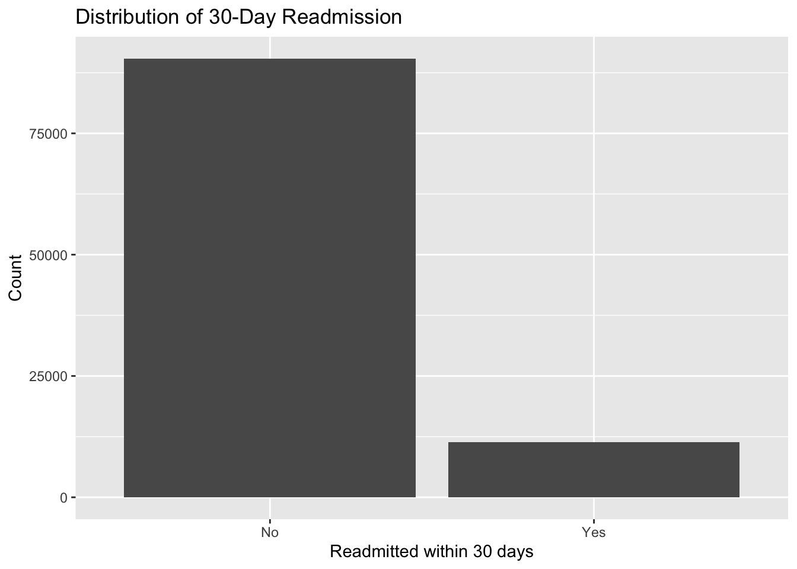
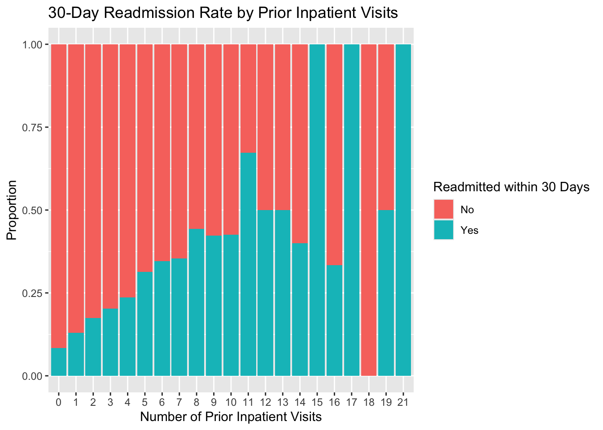
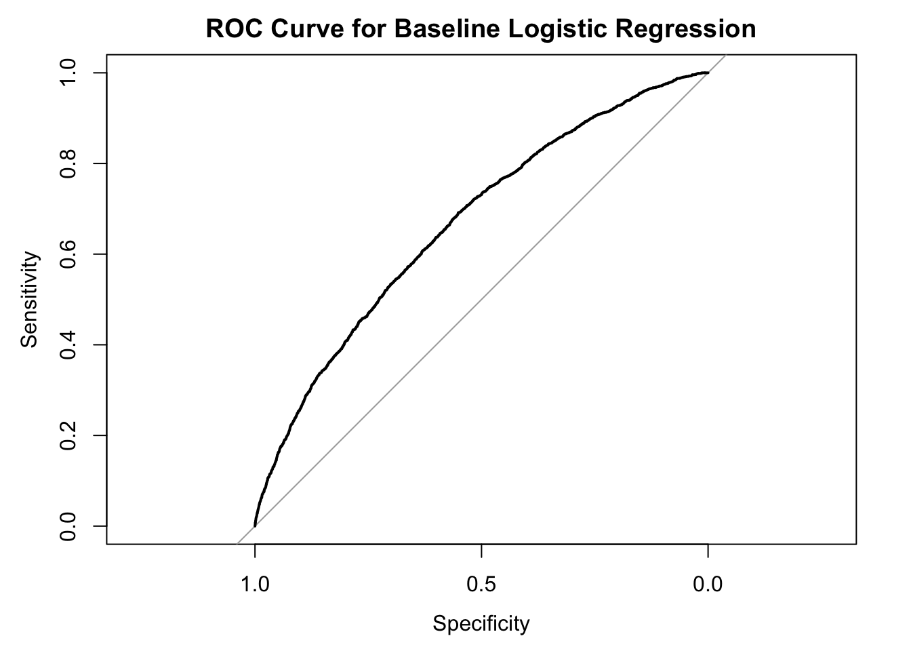
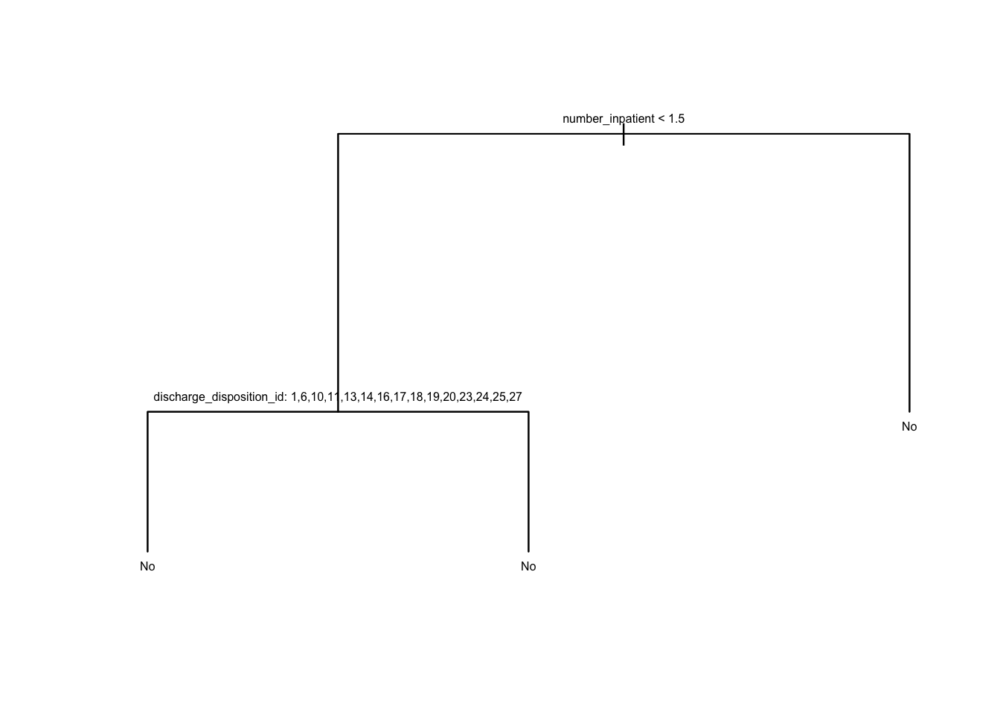
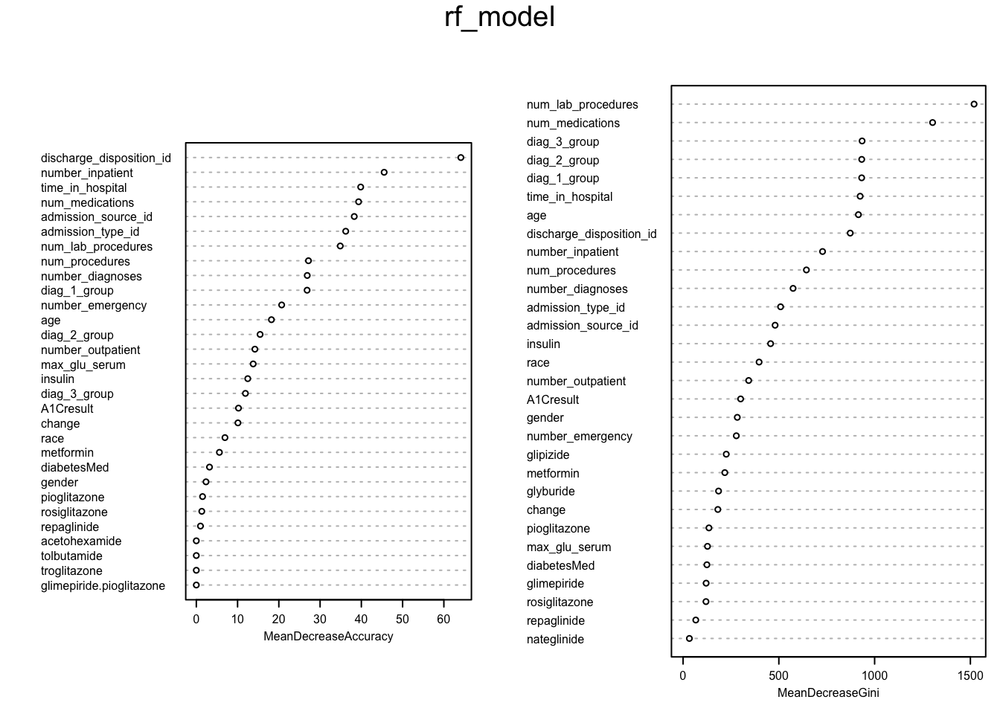
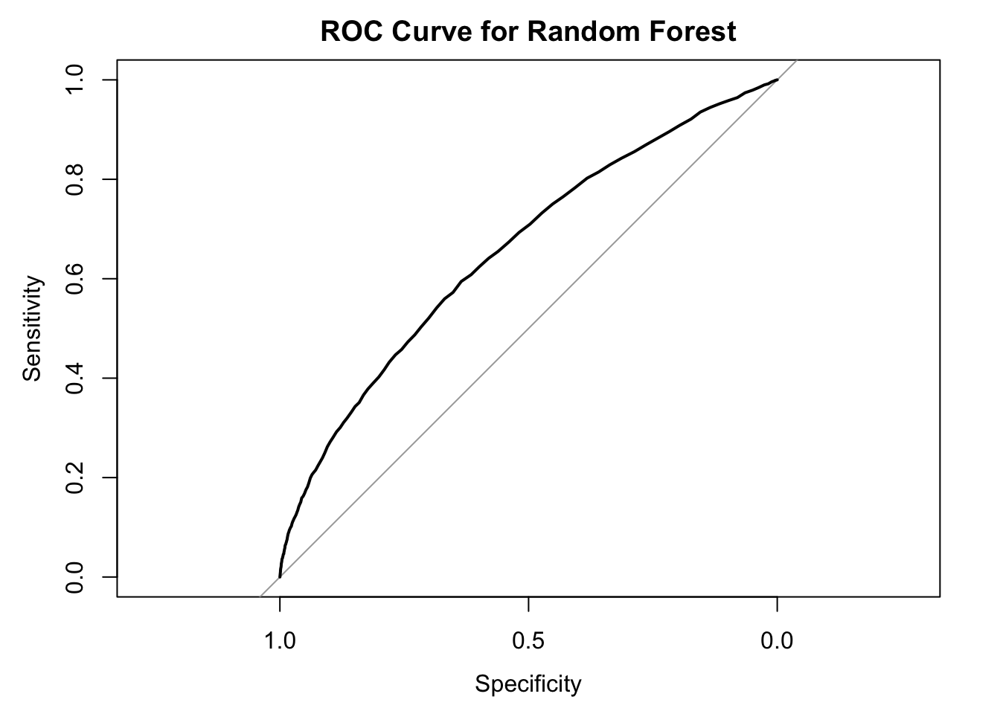

# Predicting 30-Day Hospital Readmission for Patients with Diabetes

This machine learning project predicts whether a patient with diabetes will be readmitted to a hospital within 30 days. Using 101,766 hospital encounters, we compared logistic regression, a classification tree, and random forest while accounting for severe class imbalance.

> **My role:** I was responsible for the modeling and evaluation stage, including preparing the data split for modeling, building all three classifiers, testing probability thresholds, comparing performance metrics, interpreting model results, and selecting the final model.

[View the R Markdown analysis](notebooks/diabetes_readmission_analysis.Rmd) | [View the rendered HTML](notebooks/diabetes_readmission_analysis.html) | [View the full report](reports/diabetes_readmission_report.pdf)

## Project Overview

| Item | Details |
| --- | --- |
| Problem | Binary classification of readmission within 30 days |
| Dataset | Diabetes 130-US Hospitals for Years 1999-2008 |
| Observations | 101,766 hospital encounters |
| Original variables | 50 |
| Positive class | 11.16% readmitted within 30 days |
| Models | Logistic Regression, Classification Tree, Random Forest |
| Primary metrics | AUC, Sensitivity, Specificity, Balanced Accuracy |
| Selected model | Random Forest at a 0.20 probability threshold |

## Business and Analytical Question

Hospital readmission affects both patient outcomes and hospital resource utilization. This project addresses two questions:

1. Can demographic, clinical, and hospital-utilization variables help identify patients at higher risk of 30-day readmission?
2. Which model provides the best balance between detecting readmitted patients and limiting false-positive predictions?

Because only 11.16% of encounters resulted in readmission within 30 days, accuracy alone would favor the majority class. Therefore, sensitivity, specificity, balanced accuracy, confusion matrices, and ROC-AUC were used for model evaluation.

## Team Contributions

This was a two-person group project. Contributions are listed explicitly for portfolio transparency.

| Team Member | Contribution |
| --- | --- |
| **Person 1** | Data cleaning, preprocessing, diagnosis-code grouping, and exploratory data analysis |
| **Jocelyn Chow** | Modeling and evaluation: stratified train/test split, logistic regression, classification tree, random forest, threshold analysis, ROC-AUC evaluation, model comparison, variable-importance interpretation, and final model selection |

## Dataset

The project uses the [Diabetes 130-US Hospitals for Years 1999-2008 dataset](https://archive.ics.uci.edu/dataset/296/diabetes+130-us+hospitals+for+years+1999-2008) from the UCI Machine Learning Repository.

The dataset contains ten years of clinical-care records collected from 130 U.S. hospitals and integrated delivery networks.

The original readmission outcome was converted into a binary target:

- **Yes:** The patient was readmitted within 30 days.
- **No:** The patient was not readmitted or was readmitted after more than 30 days.

The repository includes `diabetic_data.csv` and `IDS_mapping.csv` in the `data/` folder so the R Markdown analysis can be reproduced directly after downloading the project.

## Project Workflow

1. Replaced `?` values with missing values.
2. Removed `weight`, `medical_specialty`, and `payer_code` because of high missingness.
3. Replaced remaining missing categorical values with `Unknown`.
4. Converted the original three-level readmission outcome into a binary target.
5. Removed encounter and patient identifiers from the predictors.
6. Grouped detailed diagnosis codes into broader clinical categories.
7. Used an 80/20 stratified train/test split.
8. Built and evaluated three classification models.
9. Compared probability thresholds of 0.50, 0.30, and 0.20.
10. Selected the model that provided the best balance for the minority class.

## Exploratory Findings

The target variable was highly imbalanced:

- 90,409 encounters were not readmitted within 30 days.
- 11,357 encounters were readmitted within 30 days.
- The positive class represented only 11.16% of the dataset.



Prior inpatient utilization showed the clearest relationship with early readmission. Patients with more previous inpatient visits generally had higher 30-day readmission rates.



## Modeling Approach

### Logistic Regression

Logistic regression was used as an interpretable baseline model. At the default 0.50 threshold, the model achieved high accuracy but detected very few patients who were actually readmitted. Lowering the threshold improved sensitivity.

Logistic regression produced the highest overall AUC of 0.6683, but its sensitivity at the 0.20 threshold was lower than that of the tree-based models.



### Classification Tree

The classification tree provided a simple and interpretable model. The first splits identified prior inpatient visits and discharge disposition as important predictors. However, the model strongly favored the majority class and produced the lowest AUC among the three models.



### Random Forest

The random forest model used 300 trees to improve stability and predictive performance over a single classification tree. At the 0.20 threshold, random forest achieved the highest sensitivity and balanced accuracy among the tested models while maintaining 89.88% specificity.

## Model Results

The table below compares test-set performance at the 0.20 probability threshold.

| Model | AUC | Balanced Accuracy | Sensitivity | Specificity |
| --- | ---: | ---: | ---: | ---: |
| Logistic Regression | **0.6683** | 0.5618 | 0.1880 | **0.9356** |
| Classification Tree | 0.5968 | 0.5708 | 0.2699 | 0.8717 |
| **Random Forest** | 0.6569 | **0.5855** | **0.2721** | 0.8988 |

Although logistic regression had the highest AUC, random forest was selected as the most appropriate model for this project because it achieved the strongest balance between sensitivity and specificity at the selected threshold.

The results also demonstrate why model selection for an imbalanced classification problem should not rely on accuracy alone.

## Model Interpretation

Important predictors identified by the random forest included:

- Discharge disposition
- Number of prior inpatient visits
- Number of laboratory procedures
- Number of medications
- Time in hospital
- Diagnosis-group variables





## Repository Structure

```text
diabetes-readmission-prediction/
├── README.md
├── data/
│   ├── diabetic_data.csv
│   ├── IDS_mapping.csv
│   └── README.md
├── images/
│   ├── class_distribution.png
│   ├── readmission_by_age.png
│   ├── prior_inpatient_readmission.png
│   ├── readmission_by_diagnosis.png
│   ├── logistic_regression_roc.png
│   ├── classification_tree.png
│   ├── classification_tree_roc.png
│   ├── random_forest_variable_importance.png
│   └── random_forest_roc.png
├── notebooks/
│   ├── diabetes_readmission_analysis.Rmd
│   └── diabetes_readmission_analysis.html
└── reports/
    └── diabetes_readmission_report.pdf
```

## Tools and Libraries

- **Language:** R
- **Data preparation:** `tidyverse`, `dplyr`, `tidyr`
- **Data visualization:** `ggplot2`
- **Model evaluation:** `caret`, `pROC`
- **Models:** `glm`, `rpart`, `rpart.plot`, `randomForest`

## How to Reproduce the Analysis

### 1. Clone the repository

```bash
git clone https://github.com/YOUR-USERNAME/diabetes-readmission-prediction.git
cd diabetes-readmission-prediction
```

### 2. Confirm the dataset files

The required files are already included in the `data/` folder:

```text
data/diabetic_data.csv
data/IDS_mapping.csv
```

The original dataset is available from the [UCI Machine Learning Repository](https://archive.ics.uci.edu/dataset/296/diabetes+130-us+hospitals+for+years+1999-2008).

### 3. Install the required R packages

```r
install.packages(c(
  "tidyverse",
  "caret",
  "pROC",
  "rpart",
  "rpart.plot",
  "randomForest"
))
```

### 4. Run the analysis

Open `notebooks/diabetes_readmission_analysis.Rmd` in RStudio and knit the file. The data paths have already been configured to use the repository's `data/` folder.

The completed output can also be viewed in:

```text
notebooks/diabetes_readmission_analysis.html
```

## Limitations and Future Work

- The dataset covers 1999-2008 and may not reflect current clinical practices.
- The models showed only moderate discrimination and are not suitable for clinical deployment.
- Future work could use class weights or resampling methods to improve minority-class detection.
- Hyperparameter tuning could be performed for the classification tree and random forest.
- Precision-recall curves could provide additional insight into performance on the minority class.
- A patient-level split could prevent encounters from the same patient from appearing in both the training and test sets.
- Probability calibration and fairness evaluations across demographic groups would strengthen a real-world analysis.

## Reference

Clore, J., Cios, K., DeShazo, J., and Strack, B. (2014). *Diabetes 130-US Hospitals for Years 1999-2008* [Dataset]. UCI Machine Learning Repository. https://doi.org/10.24432/C5230J

## Disclaimer

This project was completed for educational and portfolio purposes only. It is not intended for clinical decision-making.
